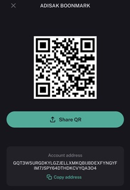

#  Algorand Labs

This project is a learning Algorand. We hope it is helpful to beginners. This project will be compile on **Ubuntu 18.04.4 LTS**.

## Reference

Algorand Developer : https://developer.algorand.org/

## Required Software

-   Node Js [Download](https://nodejs.org/en/)
-   Git [Download](https://git-scm.com/)
-   Docker [Download](https://docs.docker.com/engine/install/ubuntu/)
-   Docker Compose [Download](https://docs.docker.com/compose/install/)

## Required IDE

-   Visual Studio Code (VSCode) [Download](https://code.visualstudio.com/) **extension**
    -   Prettier [Download](https://marketplace.visualstudio.com/items?itemName=esbenp.prettier-vscode)
    -   Eslint [Download](https://marketplace.visualstudio.com/items?itemName=dbaeumer.vscode-eslint)
    -   Gitlens [Download](https://marketplace.visualstudio.com/items?itemName=eamodio.gitlens)

## Download

```sh
git clone https://github.com/ADISAKBOONMARK/algo.labs.git
```

## Setting

-   Install node package.

```sh
cd algo.labs
./npm i
```

-   Create **.env** file.

```sh
SANDBOX_PATH=/home/users/
MASTER_ADDR=HJATUIYSNT2NI6WAOE6TRWBUJFBDM5RPYOGIRZPYXF3U2OPHFTV3NCVIKM
```

> SANDBOX_PATH : Path of [Algorand Sandbox.](./lab0.setup-sandbox/README.md) directory.

```sh
cd sandbox
pwd
```

> MASTER_ADDR : Address of master account.

```sh
./sandbox goal account list
...
[online] HJATUIYSNT2NI6WAOE6TRWBUJFBDM5RPYOGIRZPYXF3U2OPHFTV3NCVIKM HJATUIYSNT2NI6WAOE6TRWBUJFBDM5RPYOGIRZPYXF3U2OPHFTV3NCVIKM 4000000000000000 microAlgos
...
```

## Outlines

-   Lab 0 : [Setup Algorand Sandbox.](./lab0.setup-sandbox/README.md)
-   Lab 1 : [Connect to Node.](./lab1.connect-node/README.md)
-   Lab 2 : [Create Account.](./lab2.create-account/README.md)
-   Lab 3 : [Send Algorand to Address.](./lab3.send-algo/README.md)

## Command

```sh
./algo.sh

Add a description of the script commands here.

command options:

account       -> Manage accounts.
- create      -> Create accounts. [Bob, Aliza]
- balance     -> Check balance accounts. [Bob, Aliza]

lab1          -> Connection to node.
lab2          -> Create account.
lab3          -> Send Algo.
```

---

## Donate :pray:

**My Wallet:**



**My QR-Code:**


**My Algorand Address:** GQT3W5URGDKYLGZJELLXMKQBIJBDEXFYNGYFIM7JSPY64DTHDKCVYQA3O4
